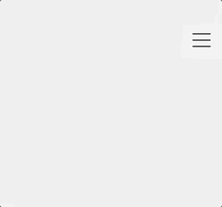
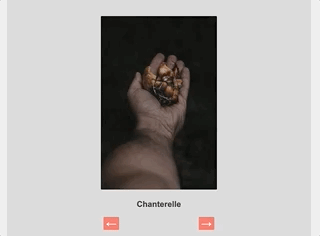
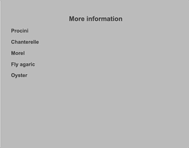

# Javascript and DOM practice

In this exercise we are building a page to offer some information about mushrooms. 

The HTML and CSS is already written for you.
Please explore the relevant section from the html file before you start writing JavaScript for that section.

In index.js file, there is an array of mushroom objects which should be used to render information on the page.

We would like to make five UI elements work with the help of Javascript, please read the requirements for each of them and also have a look at the example to get a better idea of what is expected.

1. Menu
    - When a user clicks on the burger icon we should see menu links.
    - When a user clicks again on the burger icon, the menu should disappear.
		- Hint: the menu is hidden using css display property.

2. Slider
	- We should see the image of the first item in the mushrooms array and the name of the mushroom.
	- When a user presses next or previous buttons, we should show the next or previous mushroom data from the mushrooms array.
	- When we show the last mushroom, then clicking the next button should show the first mushroom.
	- When we show the first mushroom, clicking the previous button should show the last mushroom.

	

3. Listing mushroom names
	- We should be able to see 2 lists under the Edible or poisonous section. 
	- Each mushroom has an edible property which is a boolean, the lists should be created based on that.

	

4. Accordion
	- The user should see the names of the mushrooms in a list under More info
	- When a user clicks on the name we should reveal the description of the mushrooms right under the name.
	- The user should be able to hide the description by clicking the name again. 

5. Add a mushroom
	- 
	- When the user adds information about a mushroom and clicks submit 
		we should add a new mushroom object to the mushrooms array. 
		The new mushrooms should have name, description, image and edible properties. The edible property should be a boolean and the rest should be strings.
	- If you are successful and have set the slider up correctly then clicking through the slider should show you the newly added mushroom.
	- Bonus: Update the other sections as well when a new mushroom has been added.

	

