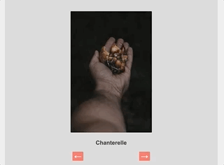
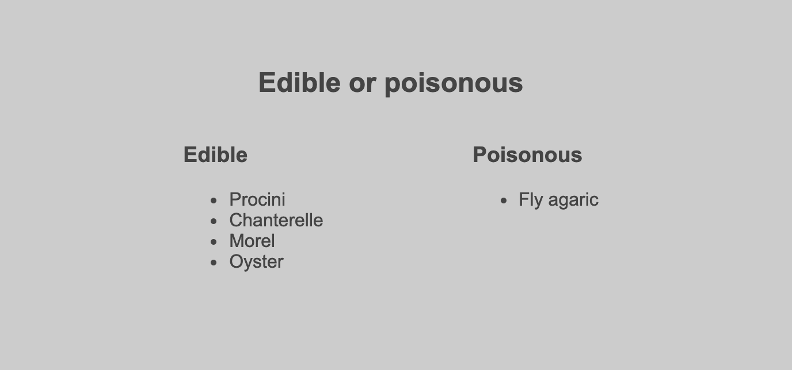
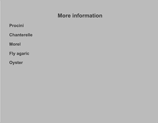

# Javascript and DOM practice

In this exercise we are building a page to offer some information about mushrooms. 

The HTML and CSS is already written for you. 
In index.js file is an array of objects which represent mushrooms. 

We would like to make four UI elements work with the help of Javascript, please read the requirements for each of them and also have a look at the example to get a better idea of what is expected.

1. Menu
    - When a user clicks on the burger icon we should see menu links.
    - When a user clicks again on the burger icon, the menu should disappear.
		- Hint: the menu is hidden using css display property.

2. Slider
	- When the page had loaded we should see the image of the first item in the mushrooms array and the name of the mushroom. 
	- When a user presses next and previous buttons, we should show the next and previous mushroom information.
	- When we show the last mushroom, then clicking next button should show the first mushroom.
	- When we show the first mushroom, clicking next should show the last mushroom.

	

3. Listing mushroom names
	- When the page has loaded we should be able to see 2 lists under Edible and poisonous section. 
	- Each mushroom has an edible property which is a boolean, the the lists should be created based on that.

	

4. Accordion
	- When a page has loaded the user should see the names of the mushrooms in a list under More info
	- When a user clicks on the name we should reveal description of the mushrooms under the name.
	- The user should be able to hide the description again by clicking the name again or from a dedicated button, up to you. 

